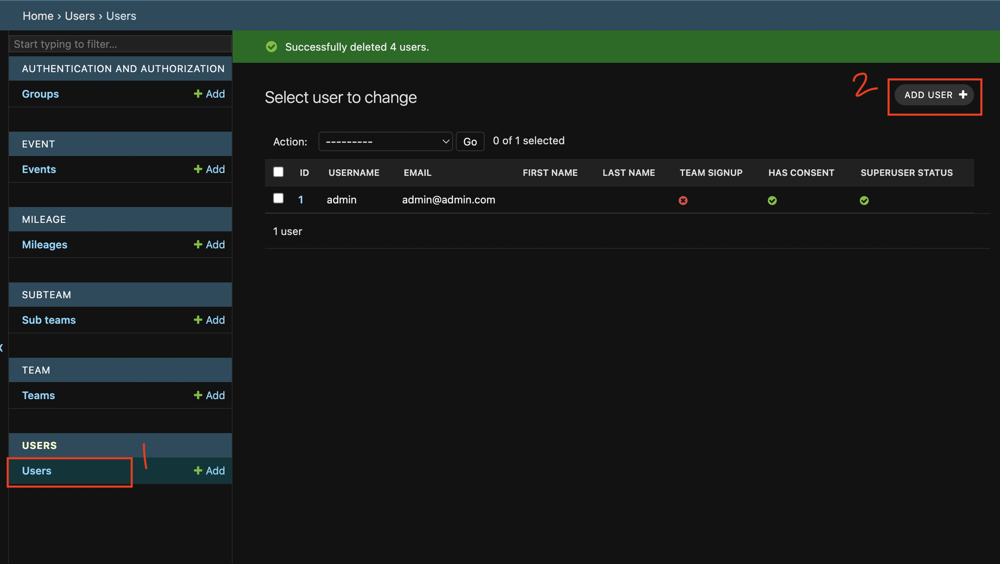
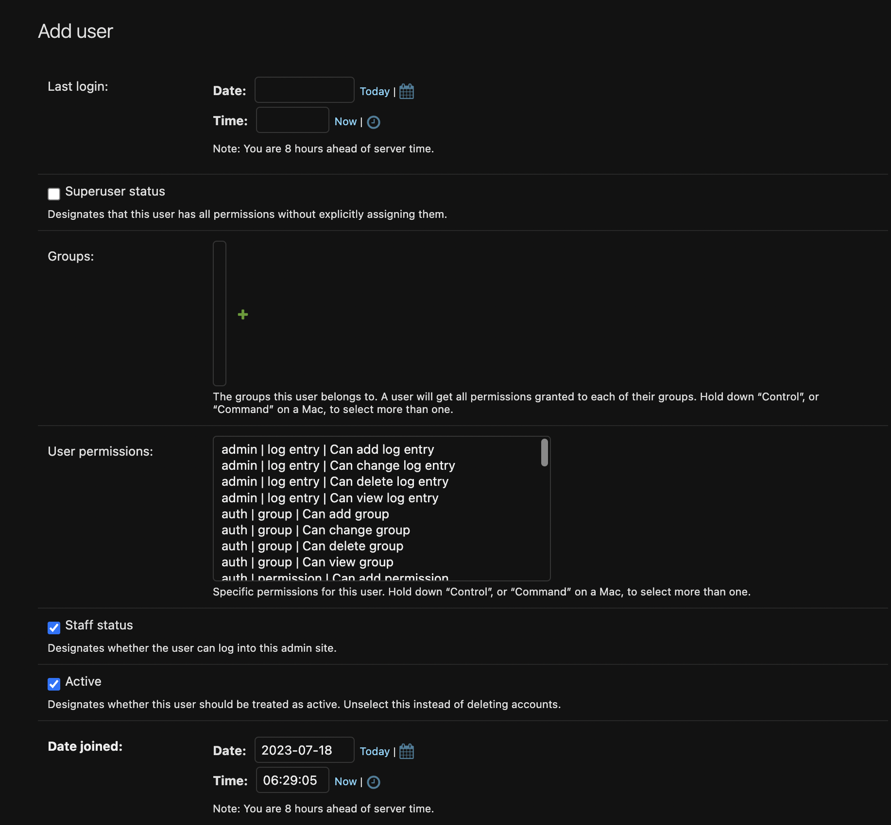
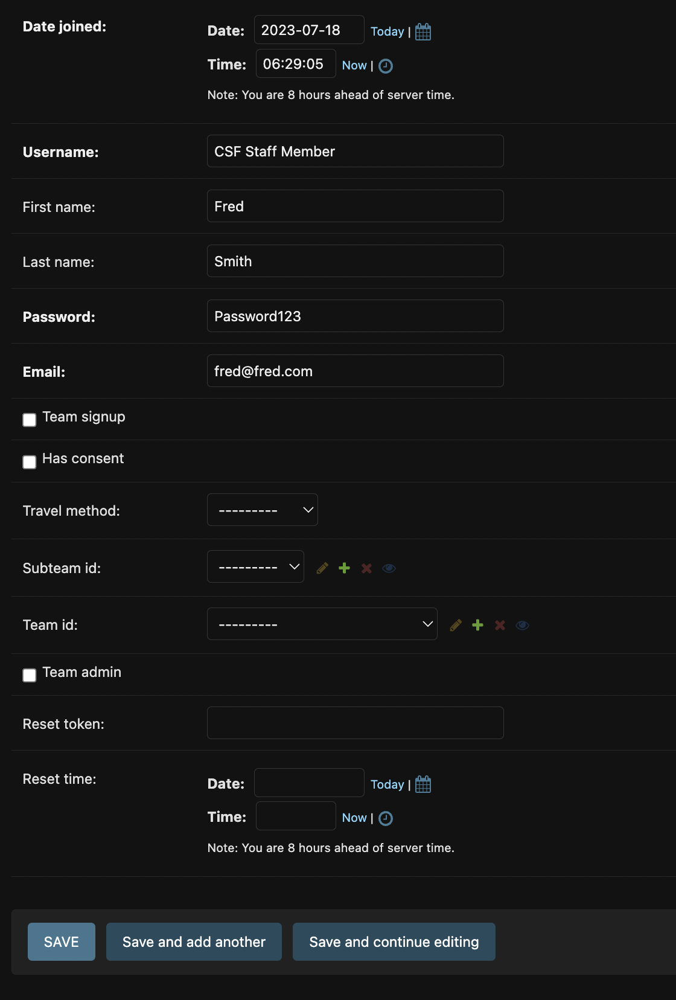

# Create Community Spirit Foundation Staff Account

1. Navigate into the users dashboard
2. Click `Add User`
   

## Filling out the User form

- `Last Login`: Keep it as default (empty)
- `Superuser status`: Unchecked
- `Groups`: Default (empty)
- `User Permissions`: Default
- `Staff Status`: Checked! - They can login into the Admin Dashboard
- `Active`: Checked
- `Date Joined`: Keep it as default
- `Username`: The username they can use to sign into the admin dashboard and the Stride For Education app
- `First Name`: Self-explanatory
- `Last Name`: Self-explanatory
- `Password`: Don't worry, this is hashed after you save and cannot be seen by others!
- `Email`: Password reset will go to this address
- `Team signup`: Ignore - Used for teachers who sign up a class
- `Has consent`: Data will not be exported to CSV if this is not checked.
- `avatar`: Select any image - to see the images they will have to sign in on the frontend
- `Travel method`: Used for the frontend app, changes icon depending on what was selected
- `Subteam id`: This can be ignored, it is used if the user has joined a team and been assigned to a subteam
- `Team id`: Used to select the team this user is part of (can be blank)
- `Team admin`: This should be checked if the user is the admin of the team above
- `Reset Token`: Ignore
- `Reset Time`: Sets challenge reset date and time (leave this as blank)

Click `Save` and your new user should be able to log into the app and admin dashboard
