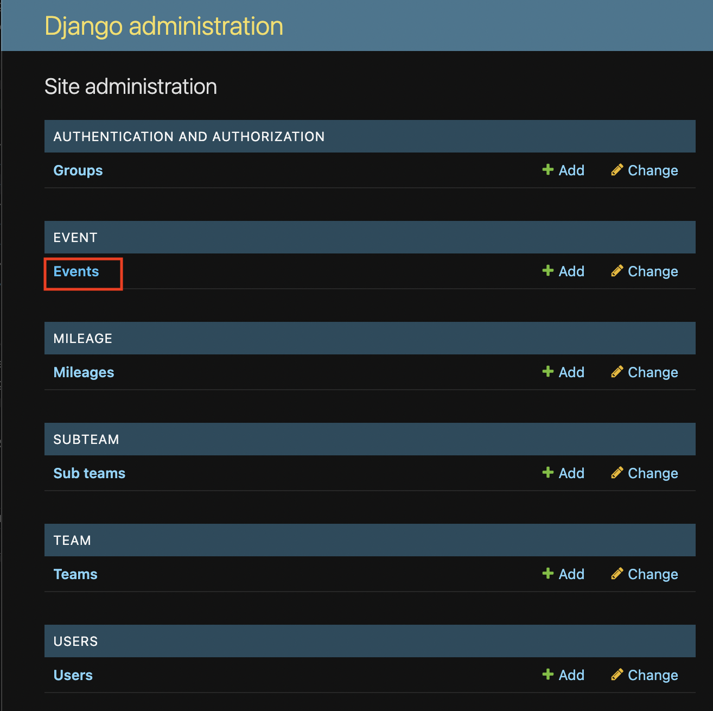
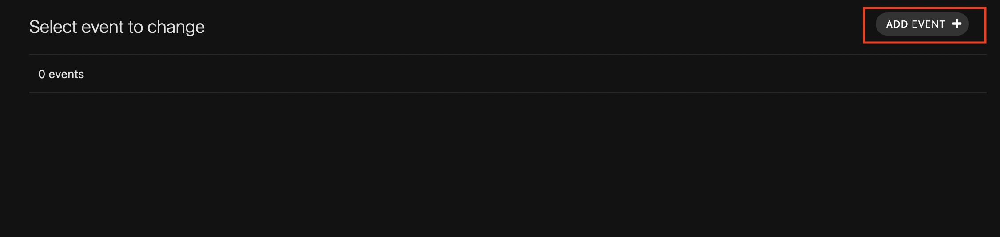
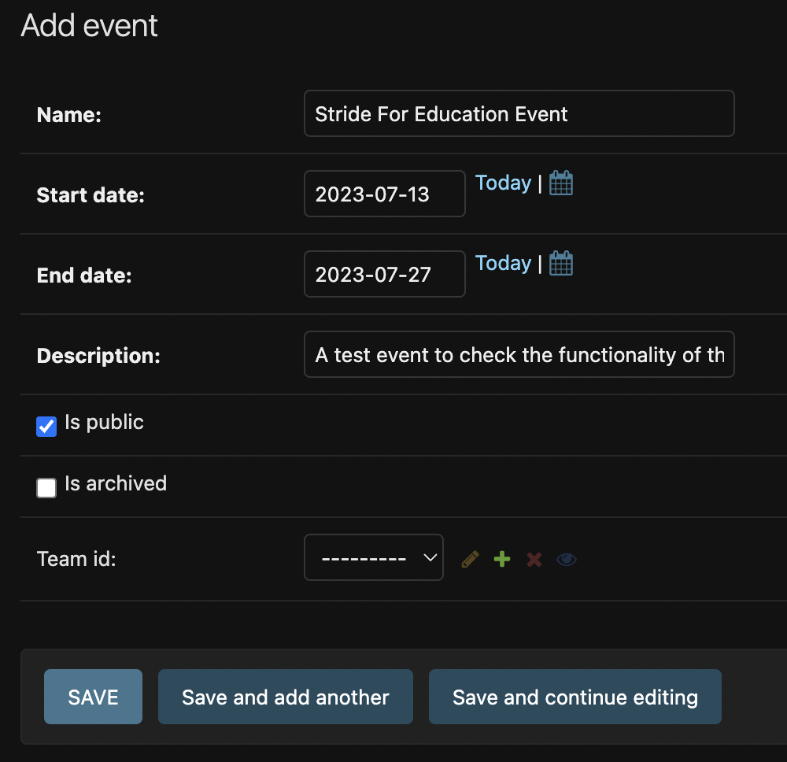
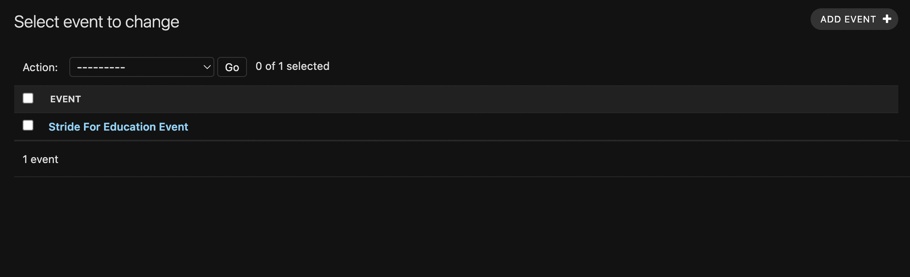
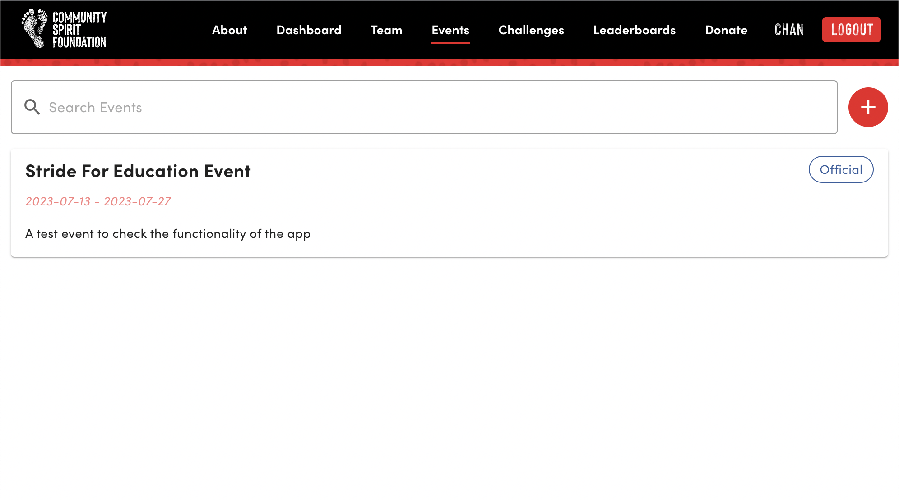
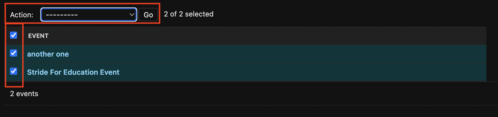

# Events

Events can be created by `Community Spirit Foundation` staff members or admin users of a team. Public events will be displayed to all viewers of the webapp and private events are used for friendly competition within a single team and will only be displayed to members of that team.

## Create New Public Event

#### Navigating to the events dashboard

Click on `Events`

#### Add Event

Click on `Add Event`

Check the `is public` box so that all users can see the event! Ignore `Team id`, this is used for when a team wants to create a private event. Save the form.

You should see your newly created event on the event dashboard page.

#### New event displayed to users

All public events will be shown to authenticated and unauthenticated users!

## Update and Delete Event

You can update the event by clicking on the Event name from the list

You can also delete multiple events at once by selecting the events you would like to delete and selecting `Delete selected events` from the action drop down menu. Press `Go` to apply the deletion.

