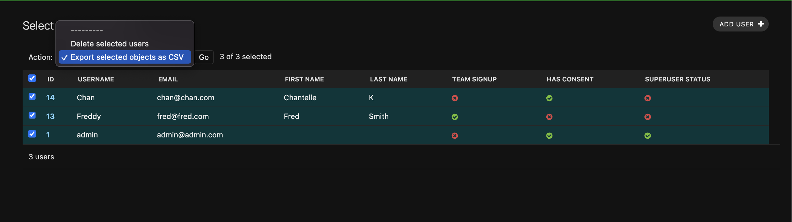
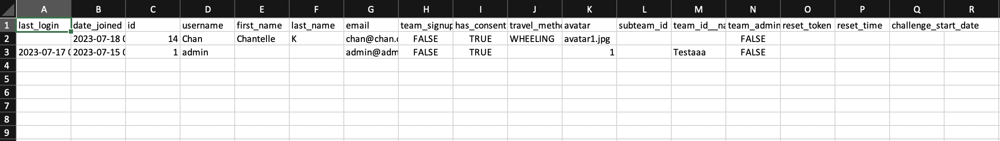

## Exporting User Data

Only users that have given consent to use their data will be include in the CSV file.

1. Select any table from the left hand side of the dashboard (i.e. Users, Events, Teams)
2. In the header row of the table you can click the checkbox to select all users or you can individually select them.
3. In the action dropdown menu select `Export selected objects as CSV` and click `Go`
4. A spreadsheet should download which can be opened in excel.

From the image below we can see that "Fred Smith" has not given us permission to export their data. This user will be excluded.

The spreadsheet will look like this for the Users table

